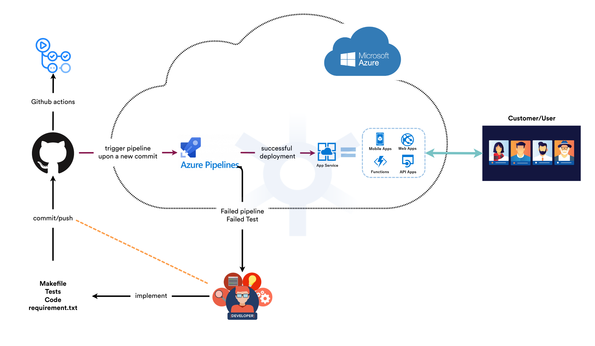
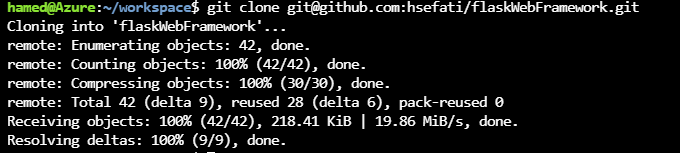
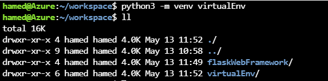
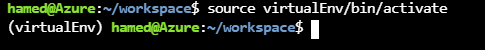
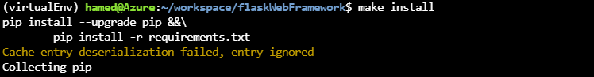
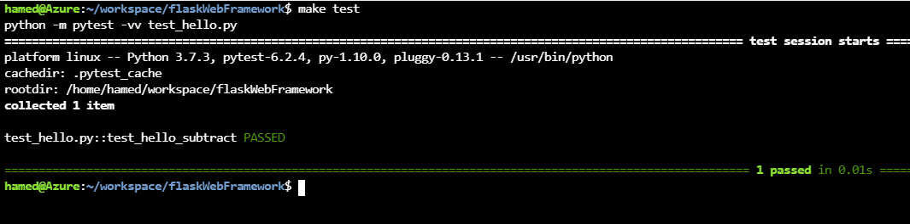
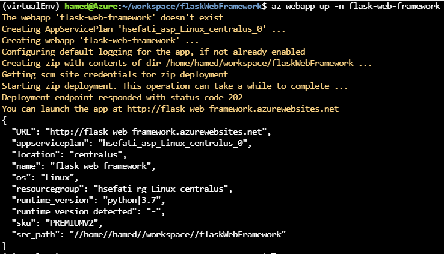
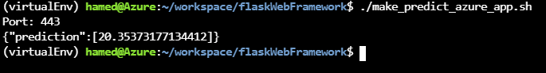
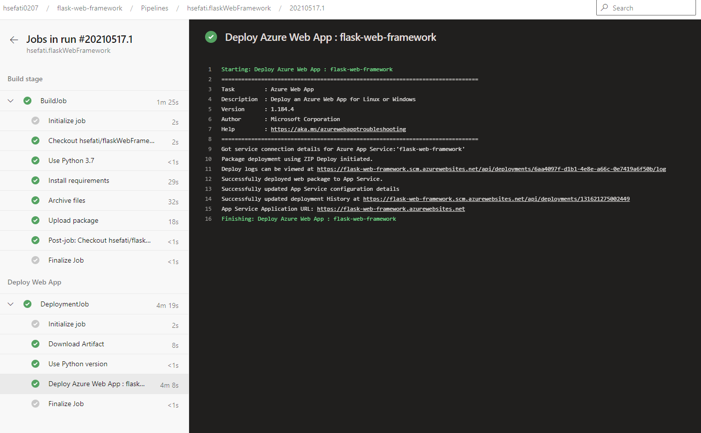
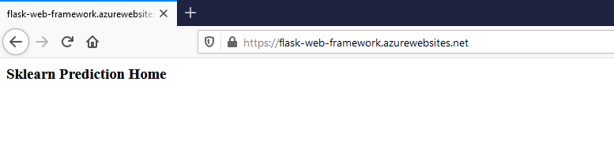

[](https://github.com/hsefati/flaskWebFramework/workflows/actions)

# Overview

In this project, we want to setup an app service in azure cloud. The app contain pre-trained sklearn model that has been trained to predict housing prices in Boston according to several features, such as average rooms in a home and data about highway access, teacher-to-pupil ratios, and so on. To deploy the app and deliver it to production, we use azure pipeline to build, test and deliver the product to app serivce of the azure.
With the help of this pipeline, we make sure that we could catch any build or functional failure (based on our test). This automation helps us a lot to maintain the app and eventually the end-user satisfied. For more details, please read the documentation to gain more inside about the different involved components and steps.

## Project Plan  
* Link to a Trello board for the project:  
    [Trello board](https://trello.com/b/sTifjl4S/flask-web-framework)
* Link to a spreadsheet that includes the original and final project plan:  
    [Final project spreedsheet](https://docs.google.com/spreadsheets/d/1rWtfx7_zRXxEdteF54JUs4DLiMqOYKX2g6_U_LPwGpk/edit?usp=sharing)  
    [Original project spreedsheet](https://docs.google.com/spreadsheets/d/1Bbvhw7yLDbKwJuximwFbkGi2EjyF1zCFsqFvuIYkY2k/copy)

## Instructions
The following diagram shows the key component of this project:  
  

In order to deploy our app service on the azure cloud, which makes the app available to the end user, we need to do the following steps:
1. In your cloud portal, open azure cloud shell
2. Clone [repository](https://github.com/hsefati/flaskWebFramework.git) into your workspace  
```bash
git clone https://github.com/hsefati/flaskWebFramework.git
```
  

**Note:** This github reposityory contain the azure piplenine plugin.
3. Create python virtual enviroment with help of following command:
```bash
python3 -m venv <virtual-env-path>  
```  
  

4. Activate the created virtual enviroment
```bash
source <virtual-env-path>/bin/activate
```
  

5. To test your code locally on azure shell, run the following command:
```bash
make all
```
It will install python packages, check python syntax and format with the help of lint and run a test to make sure everything work as it should.
You can also run all of these steps seperatly with make install or make link and make test.  
  

Also you can run the test seperatly via **make test** like below:  
  

**Note:** It helps us to make sure that everythin is done correctly until now.    

6. setup App service with the help following command on the azure cloud shell:  
**Note:** This will create a service app that later the pipeline deploy the final production into.
**Important:** You must be in the folder of your repo and the exeute the command.
```bash
az webapp up -n <name-of-your-app>
```  
  

7. Before configuring the pipeline, let us test the app ( to test the app step 6 is essential).
    * In **make_predict_azure_app.sh**, change line 28 to match your given app name (check step 6). 
    * After the modification of the line, run **make_predict_azure_app.sh**  
  

8. Now it is time to create azure pipeline. To do so, please follow [the official documentation](https://docs.microsoft.com/en-us/azure/devops/pipelines/ecosystems/python-webapp?view=azure-devops).
By following the documenation, you can create a azure pipeline, which deploy also the web app at the end of succcessful run. You should also see at the end as like below:  
  
you can access the web app via the provided link. By clicking on the URL, you must see the following web-page:  
  

9. You can access the loging of your app via the following url:
```bash
https://<name-of-your-app>.azurewebsites.net/api/logs/docker
```  
you will see the following in the browser:
```bash
[{"machineName":"RD0004FFD326E3_default","lastUpdated":"2021-05-17T17:10:22.3423387Z","size":18967,"href":"https://flask-web-framework.scm.azurewebsites.net/api/vfs/LogFiles/2021_05_17_RD0004FFD326E3_default_docker.log","path":"/home/LogFiles/2021_05_17_RD0004FFD326E3_default_docker.log"},{"machineName":"RD0004FFD326E3","lastUpdated":"2021-05-17T18:10:30.4568187Z","size":4439,"href":"https://flask-web-framework.scm.azurewebsites.net/api/vfs/LogFiles/2021_05_17_RD0004FFD326E3_docker.log","path":"/home/LogFiles/2021_05_17_RD0004FFD326E3_docker.log"}]
```


## Enhancements
To improve our work here, the following points could be considered:
* Add more comprehensive testing stage to make and eventually pipeline.
* Design and add the interactive prediction GUI to the app, so the user can interact with the app directly via web.

## Demo 
 [Demo](https://youtu.be/h2KhvCdFfCA)


